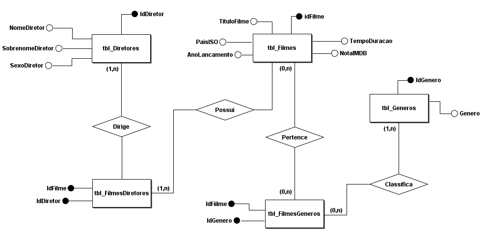
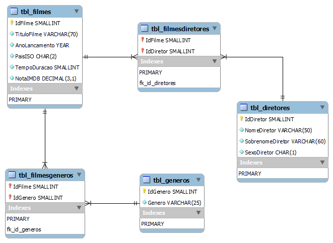

<h1 align="center"> bestPictureDB </h1>

### Sobre
Este é um projeto de banco de dados desenvolvido para praticar estudos em MySQL e SQL, focado em dados dos filmes vencedores do Oscar de Melhor Filme. O banco consiste em cinco tabelas relacionadas: Filmes, Diretores, Gêneros, FilmesDiretores (associativa entre Filmes e Diretores), e FilmesGeneros (associativa entre Filmes e Gêneros).

### Diagramas
- **Conceitual:**

- **Lógico:**
 

### Arquivos SQL

- **Criando o banco de Dados:** [CREATE_DATABASE.sql](SQL/CREATE_DATABASE.sql)
- **Criando as tabelas:** [CREATE_TABLE.sql](SQL/CREATE_TABLE.sql)
- **Inserindo os dados nas tabelas:** [INSERT_INTO.sql](SQL/INSERT_INTO.sql)
- **Realizando consultas:** [SELECT_FROM.sql](SQL/SELECT_FROM.sql)

**Resultado da consulta do banco com todos as informações formatadas:**
[DOWNLOAD.pdf](https://github.com/user-attachments/files/15990729/BESTPICTUREDB_RESULT.pdf)
